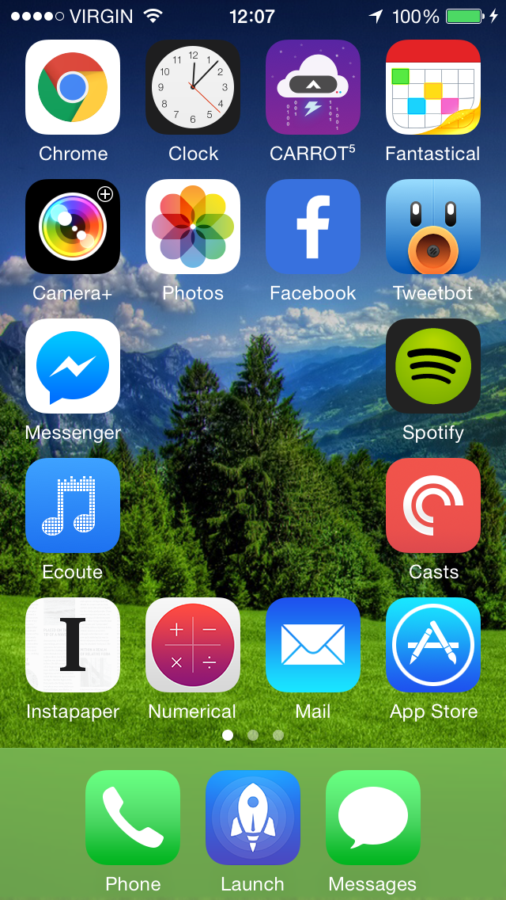
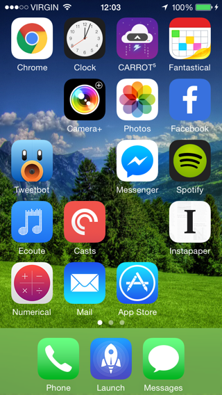
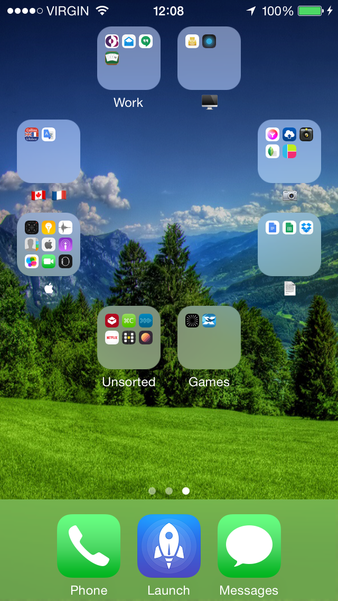
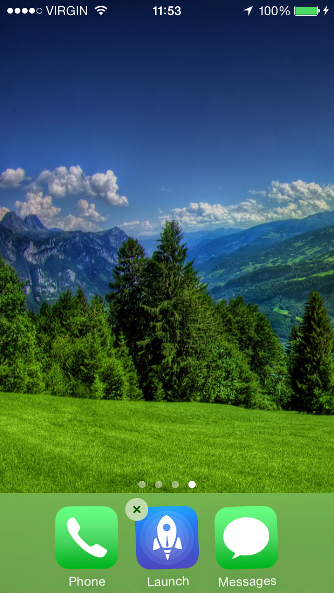
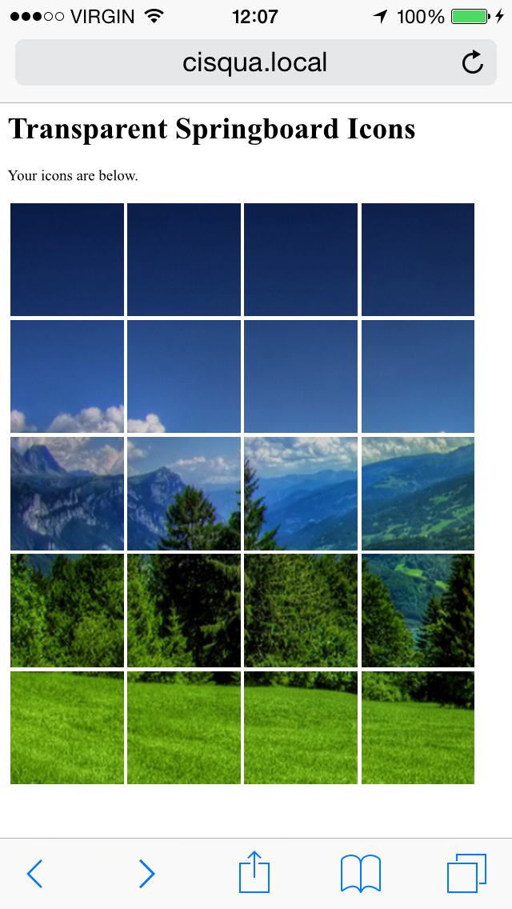
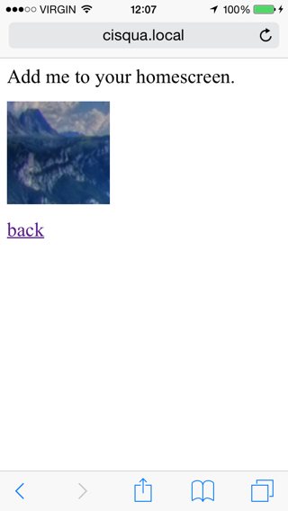
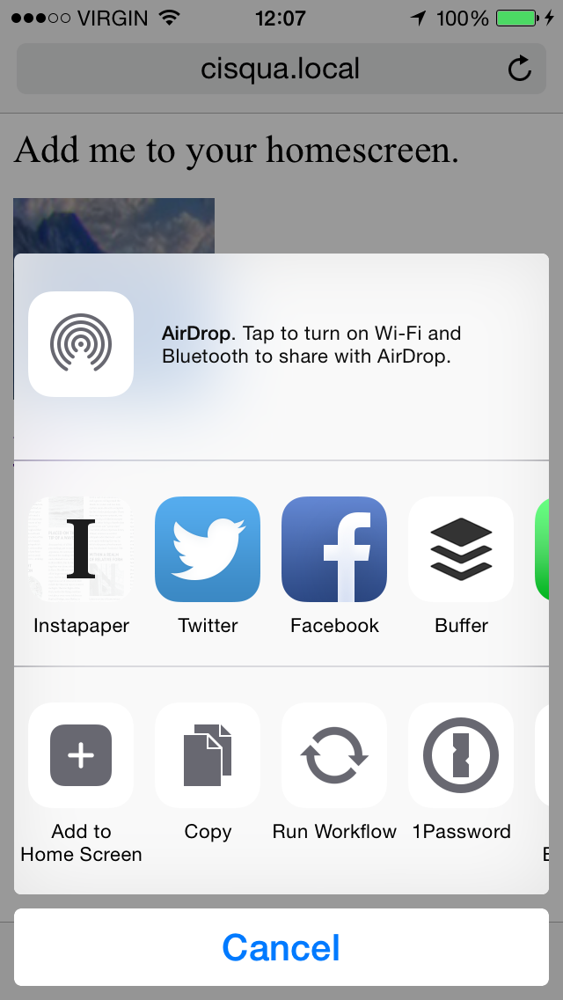
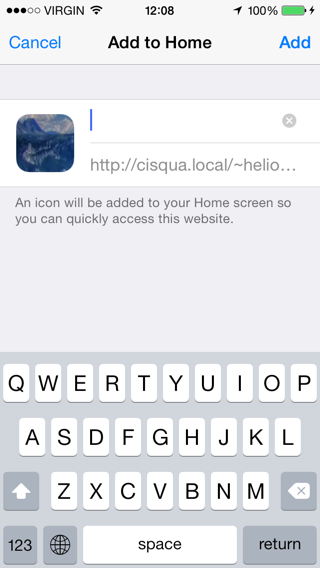

# iOS-Springboard-Spacer
## What Is It?
iOS Springboard Spacer is a shell script which helps you gain more control over icon placement and achieve custom layouts. It does not require a jailbreak.








## Which Devices Does It Support?
The script is generic enough to support several screen sizes, but currently only supports the iPhone 5, 5S, 6 and the iPod Touch 5G. I would be happy to add support for other screen sizes if the demand is there, just drop me a message here on GitHub.


## How Does It Work?
The script produces "fake" home screen icons which exactly match your background. When placed correctly, these give the appearance of empty space on your homescreen.


## How do I use It?
You'll need a bit of terminal knowhow to get this to work. These instructions are aimed at Mac and Linux users. Windows users should be able to achieve the same effect by use of [Cygwin](https://www.cygwin.com).

### Step 1: Install ImageMagick
If you're a Mac user, you can install it with [homebrew](http://brew.sh). Linux and Windows users can either use their package manager of choice, or download it from [the website](http://www.imagemagick.org/script/index.php)

Mac users can use homebrew as follows:

```brew install imagemagick```

### Step 2: Take an Screenshot of an Empty Homescreen
To do this, hold your finger down on any app icon until the app icons begin to wiggle. Now, swipe to the rightmost screen which should be devoid of icons:



Take a screenshot by pressing the home and power buttons simultaneously.

### Step 3: Copy the Image to Your Computer
Using your image transfer app of choice, copy the screenshot from your iOS device to your computer.

### Step 4: Run the Script
Create an empty directory for output, and then run the script providing the screenshot image you took in Step 3 and the empty directory you created as arguments:

```./springboard_spacer.sh --file_name /path/to/screenshot.png --output_dir /path/to/output/directory```

### Step 5: Share the Output via Apache
Using Apache, share the files in the created directory on your local network at a location that can be reached with Safari on your iOS device.

### Step 6: Install and Place the Icons
Launch Safari on your iOS device and visit the `index.html` file created by the script. You will be presented with a screen like so:



The arrangement of the grid will vary depending on the dimensions of the screenshot provided to the script. Click a location which corresponds to the location on your homescreen where you want to insert the space. You will be presented with the following page:



Click the share icon and choose "Add to Home Screen" from the options:



Add the icon to your homescreen, being sure to leave the page title blank:



You will find the icon appears on your homescreen, and you should now place it in the correct position in the same way you would place any other app icon.

You can then return to Safari and go back to the previous page to add more icons.

## FAQ

### What are the limitations?

Many ;) This is more of a curiosity than an actual workaround for icon placement. Some limitations include:

* Buffer icons are visible when swiping between home screens. As a partial workaround, you can have a single coloured background or a background consisting of horizontal stripes.
* Buffer icons are visible when swiping up to Spotlight.
* Homescreen parallax scrolling and transition effects will reveal the outline of the buffer icons. Can be worked around by enabling "Use Reduced Motion" in the accessibility section of the Settings app.
* Buffer icons are visible momentarily when waking the phone.
* Buffer icons can be launched.
* Changing your homescreen wallpaper requires creating new buffer icons.
 
### Are there plans to make a web-based version which is simpler to use?

It would be nice, but probably not. As mentioned above, this is more of a curiosity for the die-hard customisation junkies out there than something I see as being useful to most people.


### Does the script support iOS 6 an earlier?

Not at this current time, since the pre-iOS 7 icon sizes are smaller. It would be simple to add the feature if requested.

### I don't understand how the command line works! If I send you a screenshot of my empty home screen, will you generate the icons for me?

Maybe. Just drop me a message.
